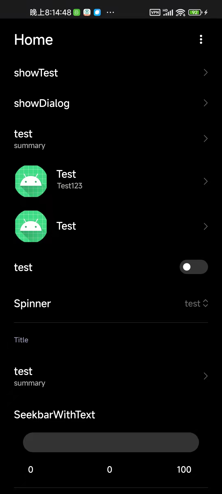

# BlockMIUI

[Demo](https://github.com/577fkj/BlockMIUIDemo)

# LICENSE
### 许可证要求:
1. 您可以在您的项目使用此项目。
2. 但是有对本项目源码做出修改，您需要提供修改后的源代码！
3. 非开源项目需要在您的项目里注明使用了BlockMIUI。

### License requirements:
1. You can use this project in your project.
2. If the source code of this project modified. You need to provide the modified source code!
3. Non open source projects you need to indicate in the project that BlockMIUI is used.
